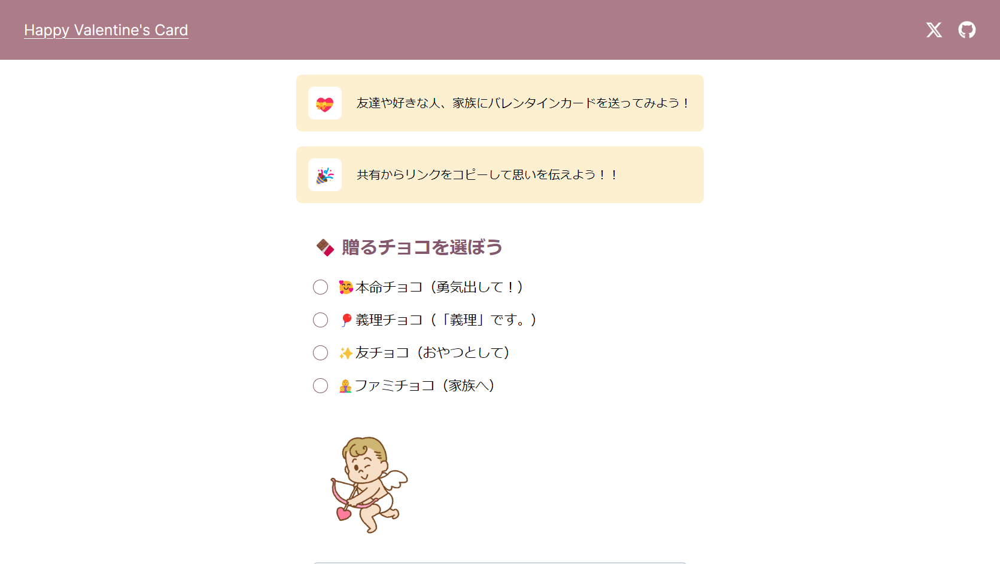
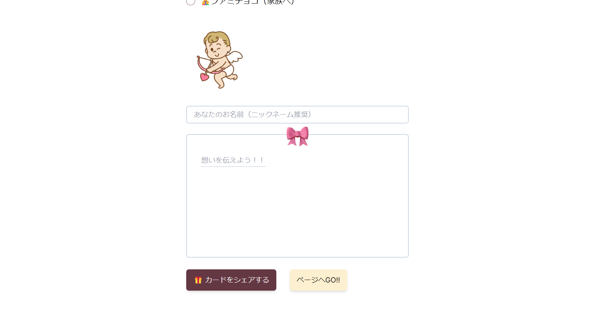

## Valentine Card App

バレンタインが近づいていたので何かアプリをサクッと作ってみたかったのでバレンタインカードのアプリを作ってみました！

このアプリでは以下の情報を入力してもらいます。

- 送りたいチョコのタイプ（画像が添付されます）
- 送り主の名前（ニックネーム推奨）
- メッセージ

情報を入力したらシェアボタンから共有するだけ！
こんな風に気軽にバレンタインカードをシェア出来ちゃいます。





## Tech
今回は以下の技術を使ってみました。

- Next.js(App router)
- Tailwind CSS
- URLパラメータ

そもそもの目的の1つが`App Router`に入門してみよう！ということでした。
また、URLパラメータに興味を持つきっかけがあったので、これも使ってみようということでした。

アプリの性質上、結果的に`"use client";`ばかりでなかなか`App Router`を活かしきれなかったなあ～と思います。

またシェアするURLのパラメータにはそのままのテキストがぶち込まれていて、文章が長いしセキュリティ的にもどうなの？とは思っています。

なのでハッシュ化などのなんらかの措置を取りたいです。

## Getting Started
Next.jsで制作したので本家と立ち上げるコマンド変わんないです。

```shell
npm run dev
# or
yarn dev
# or
pnpm dev
# or
bun dev
```

立ち上げ後は http://localhost:3000 を開いていただければ良いです。